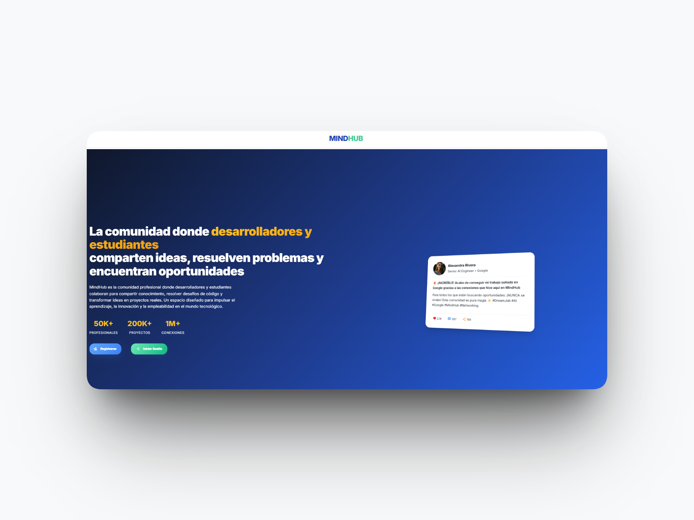
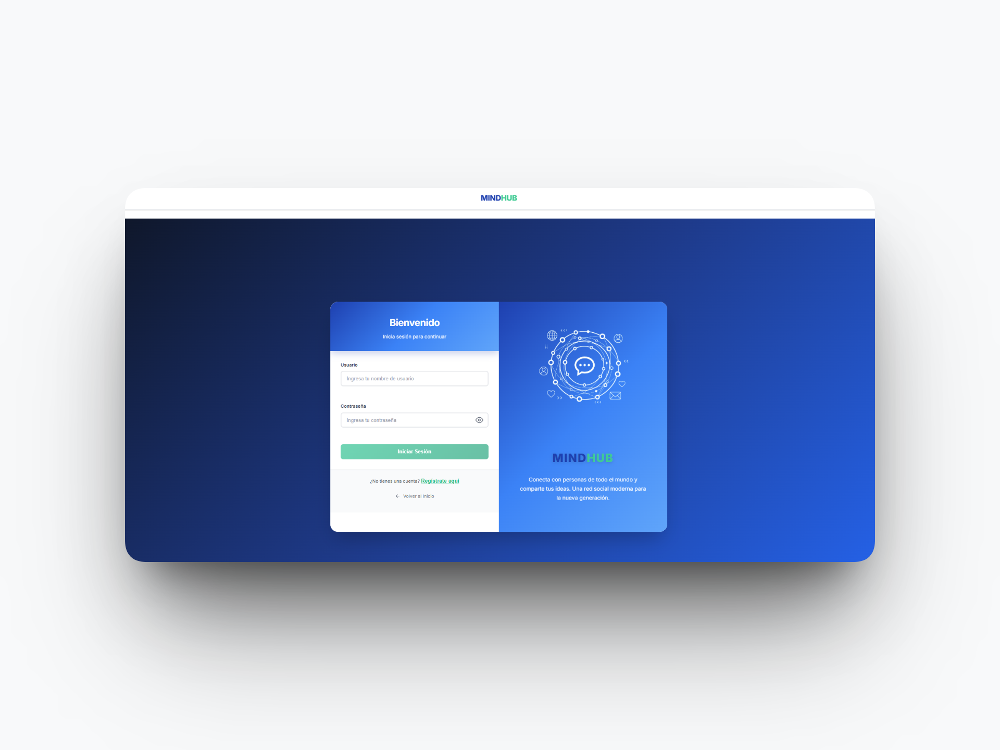
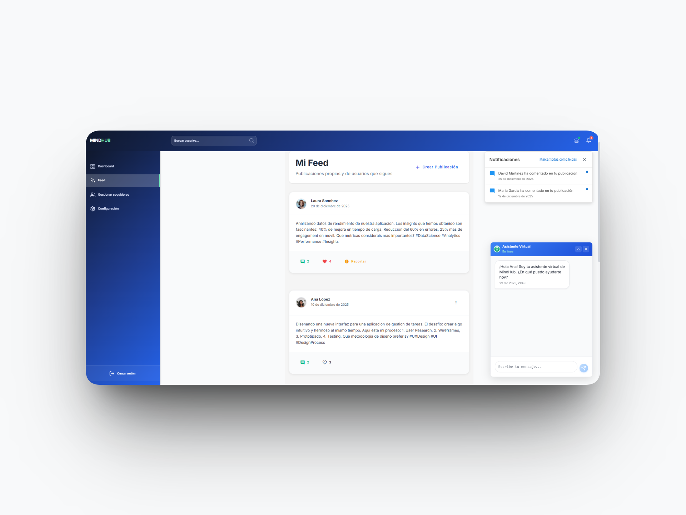
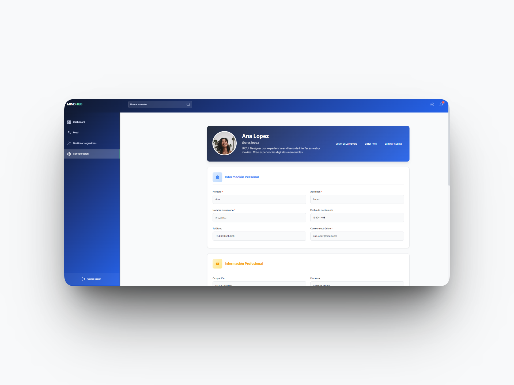
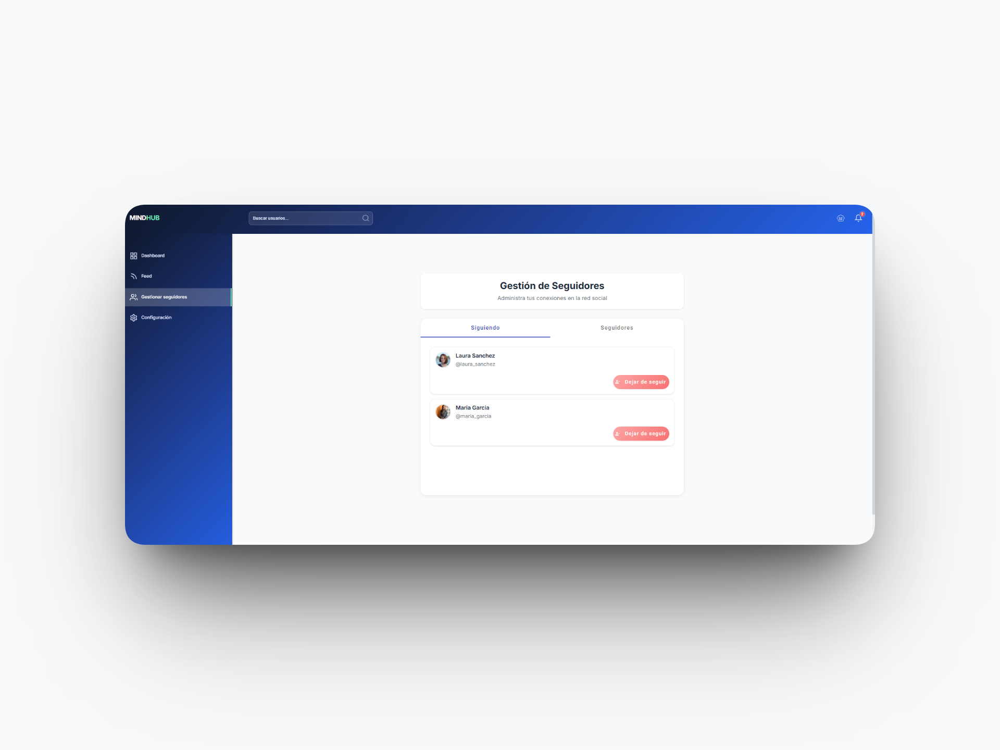
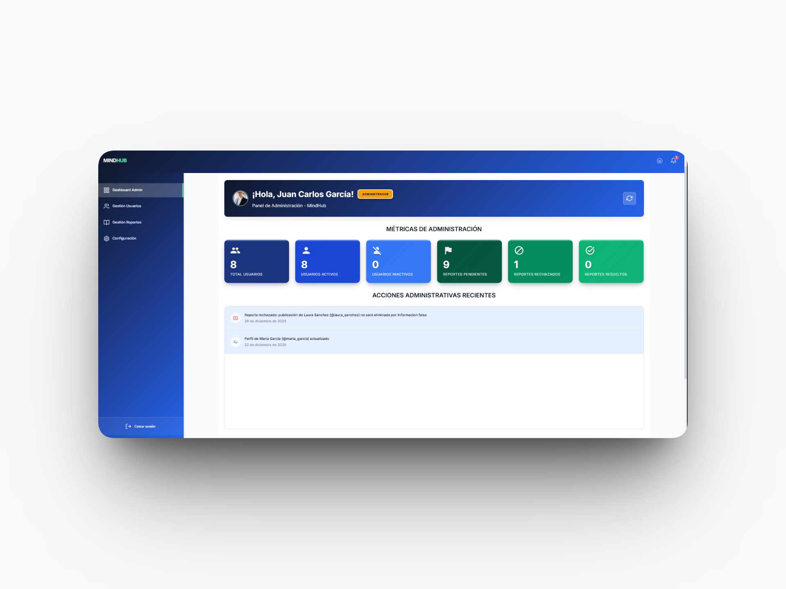
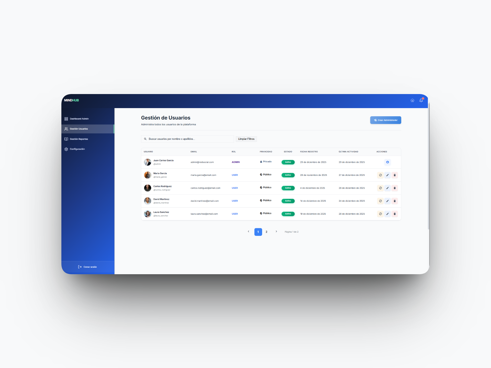
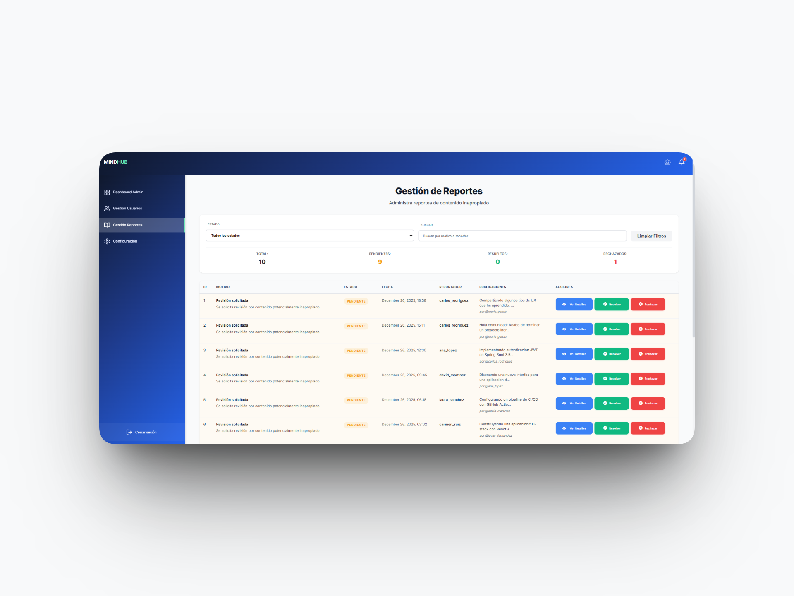

# MindHub Client Experience

> Reactive frontend orchestration and high-performance data visualization for the MindHub technical ecosystem.

<p align="left">
  
  
  
  
  
</p>

Responsive orchestration and intuitive visualization of the operational lifecycle, serving as the primary interface for content creation and administrative governance. This architecture leverages Angular Signals for fine-grained reactivity, ensuring that every user interaction—from secure publication management to real-time content moderation—is synchronized with the core security protocols and integrity standards established by the MindHub engine.

## Tech Stack & Architecture Overview

### Core Technology Stack

The MindHub frontend is engineered with a focus on type safety, reactive state management, and modular styling.

| Category | Technology | Role in Ecosystem |
| :--- | :--- | :--- |
| **Runtime** | **Node.js 22 (LTS)** | Modern JavaScript runtime & high-speed build execution. |
| **Framework** | **Angular 21 (LTS)** | Standalone architecture & optimized hydration engine. |
| **Security** | **Functional Guards** | Route protection and client-side RBAC implementation. |
| **Identity** | **Angular Signals** | Fine-grained state management & reactive identity sync. |
| **Persistence** | **RxJS State Streams** | In-memory data management and async orchestration. |
| **Styles** | **SCSS (Sass)** | Modular design system with variables and mixins. |
| **API Docs** | **TypeScript Models** | Strict contract enforcement for backend communication. |
| **Validation** | **Reactive Forms** | Strict enforcement of business data constraints. |
| **Build Tool** | **Vite / esbuild** | Dependency management and build lifecycle automation. |

### Domain Architecture & Project Structure

```text
src/app/
├── 📁 core           # Global singletons: Guards, Interceptors & Services
├── 📁 environments   # Environment configurations (API endpoints)
├── 📁 features       # Domain-encapsulated logic (DDD)
│   ├── 📁 admin      # Governance: Content moderation & Reports
│   ├── 📁 auth       # Identity: Authentication & Authorization flows
│   ├── 📁 chatbot    # AI Assistance: Interactive support components
│   ├── 📁 dashboard  # Workspace: Analytics & User overview
│   ├── 📁 notification # Real-time: System & user alert management
│   ├── 📁 profile    # Identity: User walls & Personal data
│   └── 📁 user       # Social: User interactions & Business logic
├── 📁 public         # Unauthenticated views: Landing & Error pages
└── 📁 shared         # Reusable assets: Models, Pipes & Common UI
```

**Key Architectural Principles**

- **Standalone Architecture:** Full elimination of NgModules to facilitate faster builds and optimized lazy loading.
- **Fine-Grained Reactivity:** Exclusive use of Angular Signals to minimize change detection overhead and ensure ultra-responsive UI.
- **Centralized Error Handling:** Functional HTTP Interceptors providing consistent feedback and professional error orchestration.
- **Stateless Communication:** Dedicated security layer focused on JWT management, keeping domain components independent of the auth mechanism.

### Core Implementation & Security

The system manages the full publication lifecycle through a robust reactive model, combining intuitive UX with high-level protection.

* **Stateless Authentication:** Secured with **JWT (JSON Web Tokens)** stored securely for decoupled session persistence.
* **Role-Based Access Control (RBAC):** Functional Guards ensuring users only access their authorized data, while **ADMIN** accounts maintain global governance.
* **Feature Showcase:** (Insert app screenshots here to demonstrate the UI/UX).
* **Data Flow Integrity:** Use of TypeScript interfaces and specialized Mappers to ensure a clean and secure data flow between the Backend API and the UI components.

### App Showcase

Explore the intuitive user interface and high-performance components of the MindHub ecosystem, meticulously crafted with Angular 21 and a feature-driven architecture.

### Professional Landing Experience
Full-page overview featuring a responsive layout and modular SCSS design, optimized for high engagement and brand presentation.
<p align="center">
  
</p>

### Secure Identity Access
The robust authentication gateway, implementing JWT-based session management and reactive form validation for secure user onboarding and login processes.
<p align="center">
  
</p>

### Core User Experience & Content Feed
The dynamic main workspace where users interact with technical publications. This view demonstrates real-time data orchestration through Angular Signals and seamless API integration.
<p align="center">
  
</p>

### User Identity & Personal Wall
The central hub for user identity. This view orchestrates personal data, publication history, and social metrics, providing a unified overview of the user's footprint within the ecosystem.
<p align="center">
  
</p>

### Social Network & Connections Management
A comprehensive interface for managing user relationships. This section highlights the bidirectional data flow between users and the real-time synchronization of the social graph.
<p align="center">
  
</p>

### Administrative Governance & System Overview
The command center for platform administrators. This specialized interface provides global oversight and advanced moderation tools, strictly protected by high-level RBAC (Role-Based Access Control).
<p align="center">
  
</p>

### User Administration & Governance
High-level administrative interface for managing the user ecosystem. This view allows for granular control over user accounts, role assignments, and platform integrity.
<p align="center">
  
</p>

### Content Moderation & Reporting System
Specialized oversight interface for managing community-reported content. This view facilitates the review and resolution of integrity flags, ensuring a safe and compliant environment.
<p align="center">
  
</p>

### Getting Started

#### Prerequisites
* **Node.js 22 (LTS)** or higher.
* **npm 10+** or **pnpm 9+**
* **Angular CLI 19+** (Install via `npm install -g @angular/cli`)

#### Installation & Setup
1. **Clone the repository:**
   ```bash
   git clone [https://github.com/doradosantiago-dev/mindhub-client.git](https://github.com/doradosantiago-dev/mindhub-client.git)
   cd mindhub-client

3. **Build and Run:**
   ```bash
   npm install
   ng serve
   ```

The client application will start at http://localhost:4200. You can explore the reactive UI, state management via Signals, and the domain-driven features fully integrated with the **MindHub Core Engineering** API.

> **Note:** For full functionality, ensure the backend service is running, as the frontend relies on its JWT-protected endpoints for data persistence and administrative governance.

## License

This project is open-sourced software licensed under the MIT license. Based on official Open Source Initiative standards, this allows for personal and commercial use with attribution.